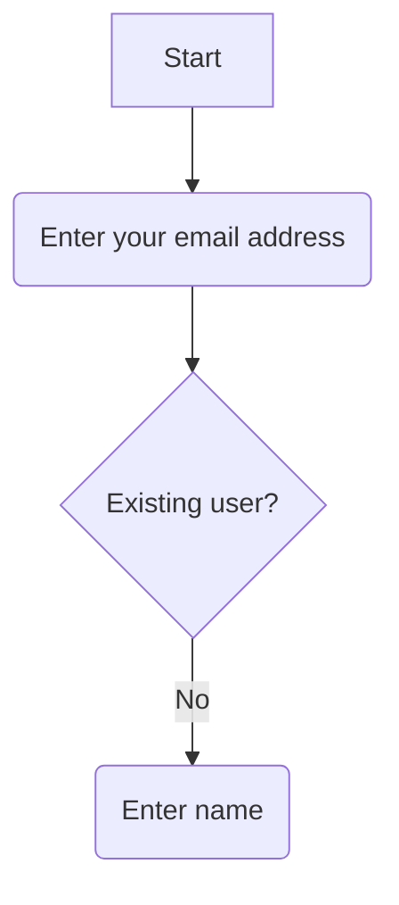

# Ttm api documentation

Let's go

```python
    # du python ici pour le back
    print('Bonjour bienfait')
```

```typescript
    // typescript pour le front
    const e = (e : string)=>{
        console.log(` bonjour bienfait ${b}`)
    }
```


