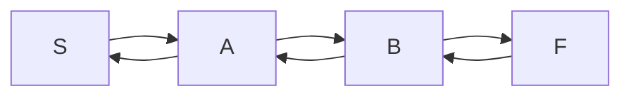
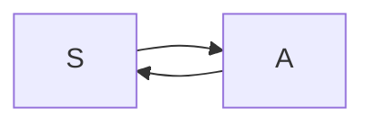
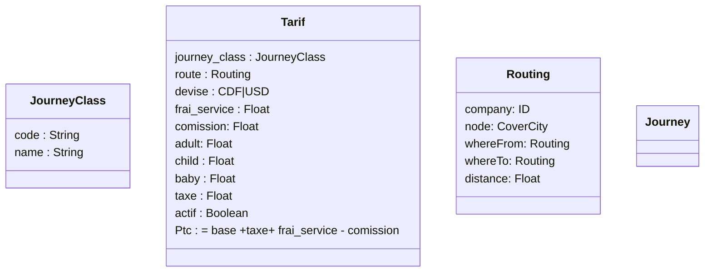

# Ttm api documentation

Let's go

```python
    # du python ici pour le back
    print('Bonjour ttm')
```

```typescript
    // typescript pour le front
    const e = (e : string)=>{
        console.log(` bonjour ttm ${b}`)
    }
```

# Routing new concept

S est la ville de depart,
A,B, sont les arrets (escales )
F ville d'arriver





# Diangramme Design last update

la comision est valable si une entreprise vent pour un autre entreprise (en %)
### NB (en %)
frais des services
taxe
comissions



